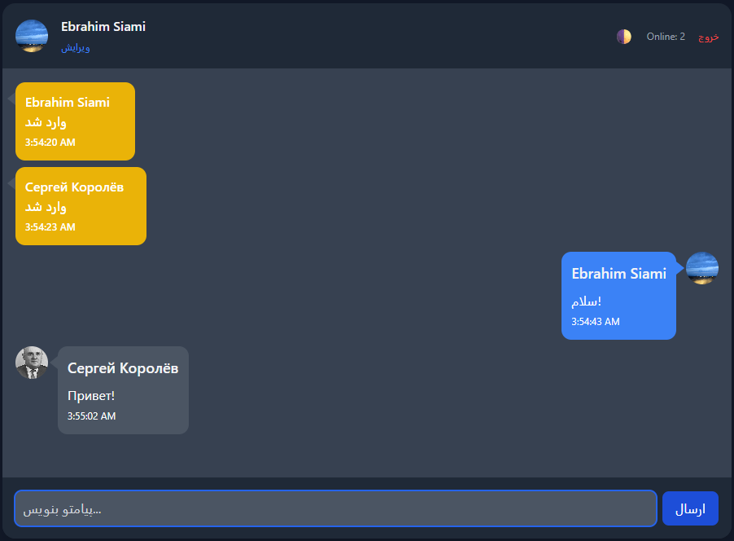
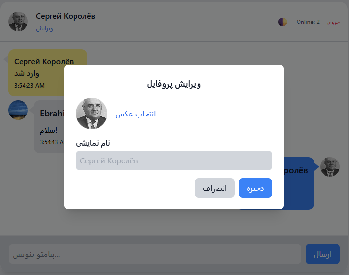

# Soyuz Messenger 🚀


**Soyuz Messenger** is a fully functional, lightweight web chat application designed to demonstrate core backend concepts without the complexity of heavy database engines.

It handles **real-time communication**, **user authentication**, and **security logic** purely through Python and a custom JSON-based file system.

---

## ✨ Key Features

### 🔌 Real-Time Communication
- Instant messaging using **WebSockets (Socket.IO)**.
- Live "Online Users" counter.
- Typographical indicators and real-time system alerts.

### 🛡️ Security & Moderation
- **Spam Protection:** Intelligent sliding-window algorithm that detects and temporarily bans spammers.
- **Moderation Tools:** Built-in support for permanent and temporary user bans.
- **Input Sanitization:** Protects against basic injection attacks.

### 💾 Custom Data Engine
- **No SQL/NoSQL Required:** Uses a structured, portable `JSON` file system (`users.json`) for data persistence.
- Easy to deploy and backup – just copy the files!

### 🎨 User Experience
- **Dark Mode** support (persists via LocalStorage).
- User profile customization (Avatars & Display Names).
- Responsive design for mobile and desktop using **Tailwind CSS**.

---

## 📸 Gallery

Here is a sneak peek into the Soyuz Messenger interface:

| Real-time Chat (Dark Mode) | Profile Settings (Light Mode) |
|:---:|:---:|
|  |  |

---

## 🛠️ Project Structure

This project follows a monolithic architecture suitable for educational purposes and lightweight deployments:

```text
SoyuzMessenger/
├── screenshots/          # Preview images for GitHub README
├── templates/            # Frontend views (HTML5 + Jinja2)
│   ├── chat.html         # Main real-time interface
│   ├── login.html        # Authentication entry point
│   └── signup.html       # User registration
├── uploads/              # Storage for user profile pictures
├── auth.py               # Authentication & User Management logic
├── server.py             # Main entry point (WebSockets, Routes & Core)
├── LICENSE.md            # Project legal permissions
├── requirements.txt      # Python dependency list
├── users.json            # Database for user profiles
├── perma_banned.json     # Permanent ban list
├── temp_bans.json        # Temporary ban list
└── spam_log.txt          # Logs for anti-spam monitoring
```
---
## 🚀 Getting Started

Follow these steps to get the chat server running on your local machine:

**1. Clone the Repository**
```
git clone https://github.com/YOUR_USERNAME/SoyuzMessenger.git
cd SoyuzMessenger
```
**2. Install Dependencies**
Make sure you have Python installed, then run:

```
pip install -r requirements.txt
```
(If you don't have a requirements file yet, run: ```pip install Flask Flask-SocketIO```)

**3. Run the Server**
```
python server.py
```
**4. Start Chatting!**
Open your browser and navigate to:
```text
http://localhost:5000
```

---

## 🌐 Public Deployment (Optional)

To test the messenger with friends over the internet without setting up a VPS, you can use **Cloudflare Tunnel**.

1. install ```cloudflared```.
2. Run the tunnel pointing to your local server port:
    ```text
    cloudflared tunnel --url http://127.0.0.1:5000
    ```
3. Share the generated link (e.g.,```https://random-name.trycloudflare.com```) with your friends!

---

## 🧠 What I Learned
This project was a deep dive into backend development. Key takeaways include:

- **WebSocket Protocol:** Understanding how persistent connections work vs. standard HTTP requests.
- **Session Management:** Handling user states securely on the server side.
- **File I/O:** Reading/Writing data concurrently to JSON files while managing locks logic.
- **Algorithmic Logic:** Implementing the rate-limiting algorithm for the anti-spam system.

---

## 🤝 Contributing

This is an open-source project created for learning purposes. Feel free to fork it, submit PRs, or use the code as a base for your own messenger!

---

Built with ❤️ by Ebrahim Siami